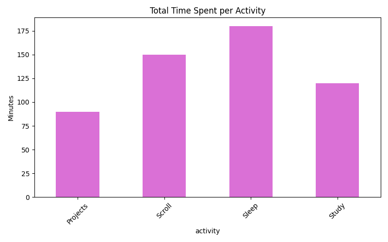
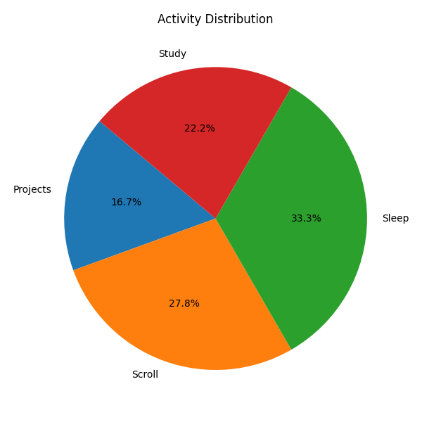

# 💖 Life Analytics Tracker – Python + Data Visualization

Ever wondered where all your time goes?  
This project helps track, analyze, and visualize how you spend your day — powered by Python, `pandas`, and `matplotlib`.

---

## 🎯 What It Does

✅ Logs your activities with timestamp and duration  
✅ Stores the data in a structured `CSV` file  
✅ Analyzes it using `pandas`  
✅ Generates insightful **bar & pie charts**  
✅ Alerts you if your screen time (e.g. scrolling) exceeds 2 hours  
✅ Prints your most time-consuming activity of the day

---

## 💡 Technologies Used

- Python 3
- `pandas` – for data manipulation  
- `matplotlib` – for visualizations  
- `colorama` – for colorful CLI output

---

## 🖼️ Output Previews

📊 Bar Chart – Total Time per Activity  


🥧 Pie Chart – Activity Distribution  


---

## 📁 Project Structure
life-analytics-tracker/
├── life_analysis.py # This file analyzes and charts the data
├── life_log.csv # Your daily activity log
├── life_bar_chart.png # Auto-generated bar chart
├── life_pie_chart.png # Auto-generated pie chart
└── README.md # This file


---

## 🚀 How to Run

1. Clone the repo:
```bash
git clone https://github.com/guptasuhani005/life-analytics-tracker.git
cd life-analytics-tracker
pip install pandas matplotlib colorama
python3 life_analysis.py
I wanted to blend real-life time tracking with data analytics — to turn everyday behavior into beautiful visual insight.
This project reflects the way I learn: by building something useful, visual, and personalized.
📬 Connect With Me
🔗 LinkedIn
💻 GitHub
📩 guptasuhani2407@gmail.com


Made with logic, color, and way too much scrolling 💅


